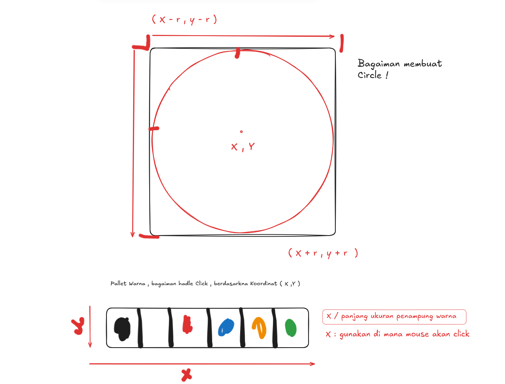

<h1 align="center">

Paint

</h1>

### Tech

- SDL2 : librrary utama untuk Generate GUI in c and c ++

### Execute

```bash

gcc -Wall -Wextra -g -o paint main.c `sdl2-config --cflags --libs` -lm

```

- `lm` : untuk link librrary (sqlr , pow );

### Fitur

- palette warna yang bisa di seleksi
- mouse bisa di ejush ukuran brush nya atas dan bawah

### How



### Reference

**Youtube** -> **Daniel Hirsch**
